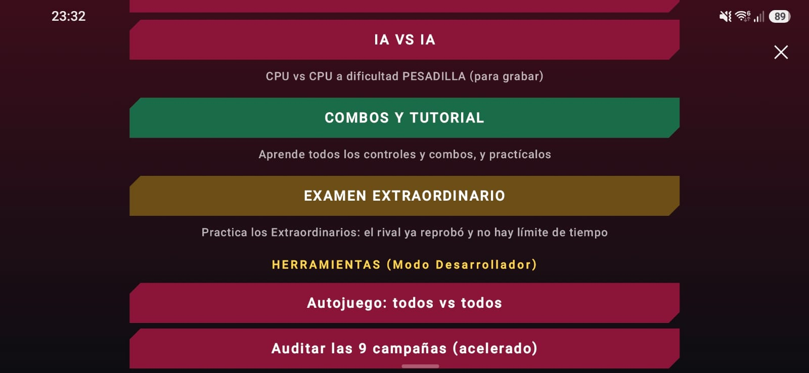
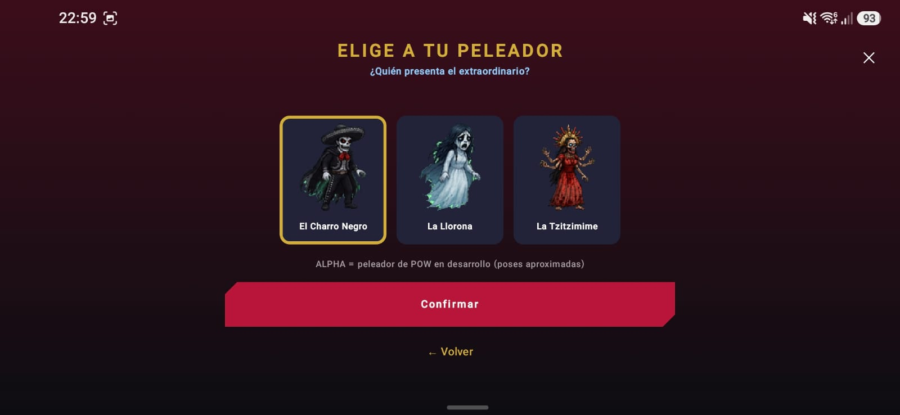
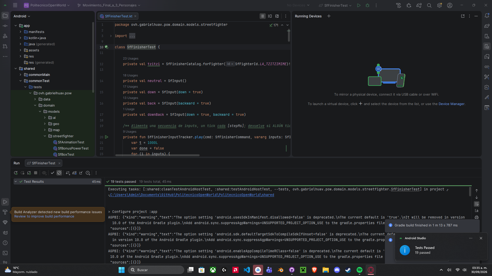
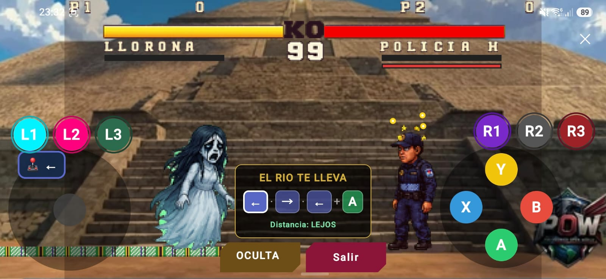
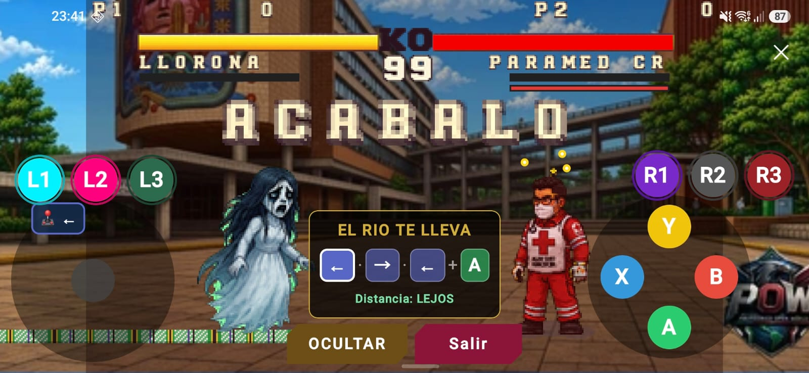

# Plan y matriz de pruebas: Extraordinarios y Examen Extraordinario

PR: https://github.com/gabrielhuav/PolitecnicoOpenWorld/pull/151
Issue: `BrandonVel47/PolitecnicoOpenWorld#2`
Rama: `Movimiento_Final_a_3_Personajes`
SHA base: `7ed325393f82872c2be94ff2ada46948efa19152`
SHA probado: `214a48c9b6515e3a6a63bd46fc32daa275809d3d` (CP-01 a CP-06 y primera ejecución de CP-07)
SHA final: `c303ce38245f8d15429bae70855762ef7246710e` (corrección H-3; segunda ejecución de CP-07)
Versión de la app: 1.0.0.18 (build debug de la rama)

> Cómo llenar este documento: el plan (pasos y resultado esperado) ya está escrito. Solo se
> llenan **Resultado real**, **Estado**, **Fecha** y **Evidencia** DESPUÉS de ejecutar cada caso.
> Estados válidos: Aprobado, Fallido, Bloqueado, No aplica.

## 1. Entorno

| Campo | Valor |
|---|---|
| Sistema operativo | Windows 11 25H2 |
| Android Studio | Quail 3 2026.1.3 (build AI-261.26222.65.2613.15948027) |
| JDK | JBR 21 incluido en Android Studio |
| SDK | compileSdk 36, minSdk 24 |
| Dispositivo | Samsung SM-A566E, Android 16 (API 36), idioma español |
| Datos de prueba | Ninguno personal. Sin `google-services.json`; `MAPS_API_KEY=DEFAULT_API_KEY` |

## 2. Criterios de aceptación

| ID | Criterio |
|---|---|
| CA-1 | Éxito: al ganar la ronda que decide el combate y meter el comando correcto a la distancia correcta, se ejecuta el Extraordinario y termina el combate. |
| CA-2 | Alterna: si el ganador golpea normal en lugar de meter el comando, no se ejecuta el Extraordinario (KO clásico en combate; REPROBADO en el modo práctica). |
| CA-3 | Modo práctica: hay un botón nuevo en el menú, solo se pueden elegir peleadores con Extraordinario y el intento se reinicia en lugar de terminar el combate. |

## 3. Riesgos

| ID | Riesgo | Impacto | Caso que lo cubre |
|---|---|---|---|
| R-1 | El gancho en `endRound` rompe el fin de ronda normal (por ejemplo, aparece ACABALO en la ronda 1). | Alto: afectaría todas las peleas. | CP-04 |
| R-2 | En el Examen Extraordinario el combate termina o se queda trabado en lugar de reiniciar el intento. | Medio: el modo no serviría para practicar. | CP-02, CP-03 |
| R-3 | Al salir del modo práctica se regresa a una pantalla equivocada o queda un estado pegado. | Medio: navegación rota. | CP-05 |
| R-4 | Fallas visuales en las cinemáticas (sprites fuera de lugar). | Bajo: solo visual. | CP-01, CP-02, CP-03 (ver H-1) |
| R-5 | Con texto grande, el panel PASOS o los botones se cortan o tapan los controles. | Bajo/medio: problema de accesibilidad. | CP-07 |

## 4. Resumen de ejecución

| ID | Tipo | Cubre | Evidencia | Estado |
|---|---|---|---|---|
| CP-01 | Ruta feliz (combate) | CA-1, R-4 | Video 1 | Aprobado |
| CP-02 | Ruta feliz (modo práctica) | CA-3, R-2, R-4 | Video 2 + capturas | Aprobado |
| CP-03 | Condición alterna | CA-2, R-2 | Video 3 | Aprobado |
| CP-04 | Regresión | R-1 | Video 1 (ronda 1) | Aprobado |
| CP-05 | Navegación y estado | R-3 | Video 2 (final) | Aprobado |
| CP-06 | Pruebas automatizadas | CA-1, CA-3 | Captura | Aprobado |
| CP-07 | Accesibilidad | R-5 | Capturas | Aprobado tras corregir H-3 |
| CP-08 | Compatibilidad | - | - | No ejecutado |

## 5. Fichas de casos

### CP-01: Extraordinario del Charro Negro en combate normal

- **Cubre:** CA-1, R-4
- **Autor:** BrandonVel47 | **Fecha:** 30/09/2026 | **SHA:** `214a48c9b6515e3a6a63bd46fc32daa275809d3d` | **Dispositivo/API:** SM-A566E / 36
- **Precondiciones:** App instalada desde la rama. Modo Práctica (VS CPU), dificultad Básica.
- **Datos:** Peleador: El Charro Negro. Rival: cualquiera.
- **Pasos:**
  1. Empezar a grabar desde el inicio de la ronda 1.
  2. Ganar la ronda 1 por KO.
  3. En la ronda 2, dejar la vida del rival en 0.
  4. Cuando aparezca ACABALO, acercarse al rival y meter → ↓ → + Y.
- **Resultado esperado:** El rival queda de pie y mareado con 0 de vida; aparece ACABALO; al meter el comando se oscurece la escena, el rival arde y desaparece; el Charro se mantiene sobre el piso todo el tiempo; aparece EXTRAORDINARIO y PACTO COBRADO; después sale el menú de fin de pelea con el Charro como ganador.
- **Resultado real:** Al dejar al rival en 0 en la ronda 2 apareció ACABALO con el rival de pie y mareado. Al meter → ↓ → + Y se oscureció la escena, el rival ardió y desapareció, y aparecieron EXTRAORDINARIO y PACTO COBRADO. El Charro se mantuvo sobre el piso. Después salió el menú de fin de pelea.
- **Estado:** Aprobado
- **Evidencia:** [Video 1](../evidencias/Video_1.mp4)
- **Defecto asociado y decisión:** H-1 (corregido antes de esta ejecución).

### CP-02: Aprobar en el Examen Extraordinario (La Tzitzimime)

- **Cubre:** CA-3, R-2, R-4
- **Autor:** BrandonVel47 | **Fecha:** 30/09/2026 | **SHA:** `214a48c9b6515e3a6a63bd46fc32daa275809d3d` | **Dispositivo/API:** SM-A566E / 36
- **Precondiciones:** App instalada desde la rama.
- **Datos:** Peleador: La Tzitzimime.
- **Pasos:**
  1. Abrir el menú de modos y tomar captura del botón EXAMEN EXTRAORDINARIO.
  2. Entrar al modo y tomar captura del selector.
  3. Empezar a grabar y elegir La Tzitzimime.
  4. Caminar hacia el rival hasta que la jerga del piso se ponga verde.
  5. Presionar PASOS y meter ↓ ↓ ← + B.
  6. Esperar a que el intento se reinicie (seguir con CP-05 sin cortar el video).
- **Resultado esperado:** El botón aparece en el menú. El selector solo muestra La Tzitzimime, La Llorona y El Charro Negro. La pelea empieza directo en ACABALO, sin conteo de ronda. La jerga pasa de roja a verde al entrar en rango. Cada dirección se palomea en el panel. Se ejecuta NOCHE SIN SOL, aparece APROBADO y el intento se reinicia solo con el rival de nuevo mareado.
- **Resultado real:** El botón aparece en el menú y el selector solo muestra a los 3 peleadores con Extraordinario. La pelea empezó directo en ACABALO, la jerga cambió de roja a verde al acercarse, el panel palomeó cada dirección y se ejecutó NOCHE SIN SOL. Apareció APROBADO y el intento se reinició.
- **Estado:** Aprobado
- **Evidencia:** [Video 2](../evidencias/Video_2.mp4)

  

  
- **Defecto asociado y decisión:** Ninguno.

### CP-03: Reprobar con un golpe normal y luego aprobar (La Llorona)

- **Cubre:** CA-2, R-2
- **Autor:** BrandonVel47 | **Fecha:** 30/09/2026 | **SHA:** `214a48c9b6515e3a6a63bd46fc32daa275809d3d` | **Dispositivo/API:** SM-A566E / 36
- **Precondiciones:** Dentro del Examen Extraordinario.
- **Datos:** Peleador: La Llorona.
- **Pasos:**
  1. Empezar a grabar y elegir La Llorona en el Examen Extraordinario.
  2. Acercarse al rival y golpearlo con un puño normal (sin comando).
  3. Esperar a que el intento se reinicie.
  4. Alejarse hasta que la jerga se ponga verde y meter ← → ← + A.
- **Resultado esperado:** El golpe normal tumba al rival y aparece REPROBADO, sin menú de fin de pelea. A los 1.5 segundos el intento se reinicia con el rival mareado otra vez. Después se ejecuta EL RÍO TE LLEVA (el rival se hunde en el agua) y aparece APROBADO.
- **Resultado real:** El golpe normal tumbó al rival y apareció REPROBADO, sin menú de fin de pelea. El intento se reinició y después se ejecutó EL RÍO TE LLEVA con APROBADO.
- **Estado:** Aprobado
- **Evidencia:** [Video 3](../evidencias/Video_3.mp4)
- **Defecto asociado y decisión:** Ninguno.

### CP-04: Regresión del fin de ronda normal

- **Cubre:** R-1
- **Autor:** BrandonVel47 | **Fecha:** 30/09/2026 | **SHA:** `214a48c9b6515e3a6a63bd46fc32daa275809d3d` | **Dispositivo/API:** SM-A566E / 36
- **Precondiciones:** Igual que CP-01 (se observa en el mismo video).
- **Datos:** Peleador: El Charro Negro.
- **Pasos:**
  1. En el video de CP-01, observar el final de la ronda 1.
- **Resultado esperado:** La ronda 1 termina con KO clásico, sin ACABALO ni velo oscuro, porque todavía no decide el combate. Después empieza la ronda 2 con normalidad, igual que en `main`.
- **Resultado real:** La ronda 1 terminó con KO clásico, sin ACABALO ni velo oscuro, y la ronda 2 empezó normal.
- **Estado:** Aprobado
- **Evidencia:** [Video 1](../evidencias/Video_1.mp4) (final de la ronda 1)
- **Defecto asociado y decisión:** Ninguno.

### CP-05: Navegación al salir del modo

- **Cubre:** R-3
- **Autor:** BrandonVel47 | **Fecha:** 30/09/2026 | **SHA:** `214a48c9b6515e3a6a63bd46fc32daa275809d3d` | **Dispositivo/API:** SM-A566E / 36
- **Precondiciones:** Dentro del Examen Extraordinario (continuación de CP-02, mismo video).
- **Datos:** La Tzitzimime.
- **Pasos:**
  1. Después del reinicio de CP-02, presionar SALIR.
  2. Observar a qué pantalla regresa.
- **Resultado esperado:** SALIR regresa al selector del Examen Extraordinario (no al de Arcade ni al de Práctica) y se puede volver a elegir un peleador. La orientación del juego se mantiene en horizontal.
- **Resultado real:** SALIR regresó al selector del Examen Extraordinario y se pudo elegir otro peleador. El juego se mantuvo en horizontal.
- **Estado:** Aprobado
- **Evidencia:** [Video 2](../evidencias/Video_2.mp4) (final)
- **Defecto asociado y decisión:** Ninguno.

### CP-06: Pruebas automatizadas

- **Cubre:** CA-1, CA-3 (lógica aislada)
- **Autor:** BrandonVel47 | **Fecha:** 30/09/2026 | **SHA:** `214a48c9b6515e3a6a63bd46fc32daa275809d3d`
- **Precondiciones:** Proyecto sincronizado en Android Studio.
- **Pasos:**
  1. Abrir `shared/src/commonTest/.../streetfighter/SfFinisherTest.kt`.
  2. Presionar el botón de ejecutar junto a `class SfFinisherTest` y elegir Run.
- **Resultado esperado:** 19 tests aprobados (lectura de comandos, rangos, catálogo, efectos, flechas volteadas, zona de la jerga, progreso de pasos y el test que impide usar TALK).
- **Resultado real:** 19 tests aprobados, 0 fallidos.
- **Estado:** Aprobado
- **Evidencia:**

  
- **Nota:** `gradlew.bat` no se pudo ejecutar localmente porque falta `gradle-wrapper.jar` en la copia del repositorio (limitación del entorno, no del cambio). Se ejecutó la misma tarea `:shared:testAndroidHostTest` desde Android Studio. Los checks del PR quedan pendientes de aprobación del mantenedor.

### CP-07: Accesibilidad (texto ampliado)

- **Cubre:** R-5
- **Autor:** BrandonVel47 | **Fecha:** 30/09/2026 | **Dispositivo/API:** SM-A566E / 36
- **Precondiciones:** En Ajustes del teléfono, Pantalla, Tamaño y estilo de fuente: tamaño grande, por debajo del máximo. Con el tamaño máximo no se puede llegar a Otros modos (ver H-2).
- **Datos:** Peleador: La Llorona.
- **Pasos:**
  1. Con la fuente grande, abrir el menú de modos y tomar captura.
  2. Entrar al Examen Extraordinario con La Llorona y presionar PASOS.
  3. Tomar captura con el panel abierto.
  4. Revisar que los textos se lean completos, que PASOS y SALIR se puedan tocar y que el panel no tape el joystick ni los botones.
  5. Regresar el tamaño de fuente a normal.
- **Resultado esperado:** El botón y la descripción del modo se leen completos en el menú. El panel PASOS, el texto "Distancia: LEJOS" y los botones PASOS/OCULTAR y SALIR se leen completos y no tapan los controles.
- **Resultado real:**
  - Ejecución 1 (SHA `214a48c9b6515e3a6a63bd46fc32daa275809d3d`): el menú y el panel PASOS se leen completos y no tapan los controles, pero el botón OCULTAR se corta y se lee "OCULTA". Fallido (H-3).
  - Ejecución 2 (SHA `c303ce38245f8d15429bae70855762ef7246710e`): el botón muestra OCULTAR completo; el resto sin cambios. Aprobado.
- **Estado:** Aprobado (tras corregir H-3)
- **Evidencia:**

  

  

  
- **Defecto asociado y decisión:** H-3 (corregido). H-2 (preexistente, fuera del alcance del PR).
- **Limitaciones registradas:** no se probó TalkBack. La jerga indica el rango solo con color (rojo/verde); como apoyo, el panel PASOS muestra la distancia también en texto. Los textos dibujados en la escena (ACABALO, EXTRAORDINARIO) usan la fuente del juego y no cambian con el tamaño de fuente del sistema.

### CP-08: Compatibilidad

- **Estado:** No ejecutado.
- **Motivo:** Solo se contó con un dispositivo y no se probó otro idioma. Los textos del modo se agregaron en español e inglés (`values/strings.xml` y `values-en/strings.xml`), pero la versión en inglés no se verificó en pantalla.

## 6. Hallazgos

| ID | Descripción | Pasos | Esperado vs observado | Severidad | Estado |
|---|---|---|---|---|---|
| H-1 | En el Extraordinario del Charro Negro el peleador se hunde bajo el escenario durante el primer segundo y luego vuelve a subir. | Meter el comando del Charro Negro y observar el inicio de la cinemática. | Esperado: el Charro se mantiene sobre el piso. Observado: se dibuja 96 px más abajo. Causa: los cuadros de TALK de los 18 peleadores tienen el origen en y=128 en lugar de y=224 (defecto de datos preexistente). | Baja (solo visual) | Corregido en `214a48c`: la cinemática usa TAUNT en lugar de TALK y un test impide volver a usar TALK. Repetido en CP-01. El defecto de datos de TALK queda como preexistente. |
| H-2 | Con el tamaño de fuente del sistema al máximo no se puede llegar a "Otros modos" desde el menú de peleas. | Ajustes > Pantalla > Tamaño de fuente al máximo; abrir el modo de peleas e intentar entrar a Otros modos. | Esperado: se puede navegar hasta Otros modos. Observado: El botón era demasiado grande para poder navegar entonces se tuvo que cambiar por un tamaño no tan grande. | Media (impide usar el juego con texto muy grande) | Preexistente: ocurre en una pantalla que el PR no modifica. No se corrige en este PR. |
| H-3 | Con la fuente del sistema grande, el botón OCULTAR del Examen Extraordinario se corta y se lee "OCULTA". | Fuente grande; Examen Extraordinario; presionar PASOS. | Esperado: el botón muestra OCULTAR completo. Observado: se lee OCULTA porque el botón tenía ancho fijo (118 dp). | Baja (visual, el botón sí funciona) | Corregido en `c303ce3`: los botones usan ancho mínimo y crecen con el texto. Repetido en CP-07. |

Avisos preexistentes (también aparecen en `main`, no son del cambio): advertencias `AGPBI ... is deprecated` al compilar y el mensaje `google-services.json NO encontrado`.

Nota: el commit de H-3 (`c303ce3`) solo cambia el ancho de los botones PASOS/SALIR; por eso se repitió únicamente CP-07. Los casos CP-01 a CP-06 se ejecutaron sobre `214a48c` y no se ven afectados.

## 7. Cierre del QA

- **Recomendación de integración:** Sí, se recomienda integrar. Los criterios CA-1, CA-2 y CA-3 se cumplieron y no quedan defectos propios abiertos. La decisión final queda sujeta a que los checks del PR (pendientes de aprobación del mantenedor) pasen.
- **Evidencia que la respalda:** 7 casos ejecutados y aprobados (CP-01 a CP-07), 19 pruebas unitarias aprobadas, análisis de detekt sin hallazgos nuevos y 3 hallazgos documentados: H-1 y H-3 corregidos y verificados, H-2 preexistente y fuera del alcance.
- **Riesgos que permanecen:** compatibilidad no verificada (CP-08 no ejecutado) y TalkBack no probado; los Extraordinarios no funcionan en partidas en línea (excluidos a propósito); el patrón de la jerga se basa en una foto de referencia de internet.